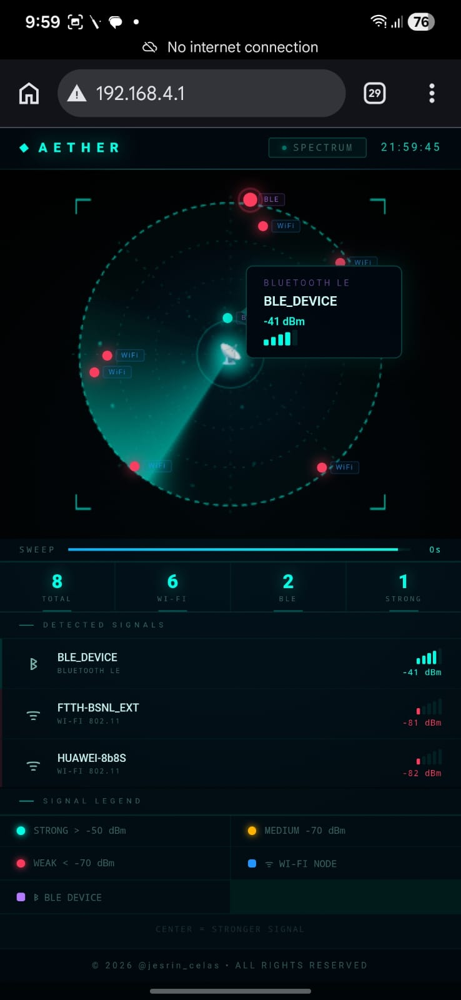

# AETHER // SPECTRUM

A cinematic real-time radar-style wireless telemetry dashboard for ESP32.

AETHER // SPECTRUM visualizes nearby Wi-Fi and BLE signals using a futuristic radar interface featuring dynamic sweep physics, phosphor trails, animated nodes, and live telemetry visualization.

---

# ✨ Features

## 📡 Radar Engine

* Organic radar sweep motion
* Adaptive sweep velocity
* Phosphor trail rendering
* Atmospheric radar particles
* Dynamic radar flicker effects
* Signal-strength distance plotting

## 📶 Wireless Detection

* Wi-Fi scanning
* BLE scanning
* RSSI visualization
* Strong / Medium / Weak classification
* Real-time device updates

## 🖥 UI System

* Responsive fullscreen dashboard
* Futuristic telemetry aesthetic
* Animated signal nodes
* Radar glow system
* Mobile-friendly layout
* Lightweight frontend

## ⚡ Embedded Optimization

* Gzip compressed HTML delivery
* ESP32 PROGMEM support
* Single-file frontend deployment
* Optimized for embedded serving

---

# 🧠 Technologies Used

## Frontend

* HTML5
* CSS3
* Vanilla JavaScript
* Canvas API

## Embedded

* ESP32
* Arduino Framework
* AsyncWebServer
* PROGMEM
* Gzip Compression

---

# 📱 Performance Notes

AETHER // SPECTRUM is optimized for:

* Mobile browsers
* Embedded serving
* Low-bandwidth telemetry
* Real-time animation rendering

Recommended:

* Use ESPAsyncWebServer
* Enable gzip delivery
* Serve locally from ESP32 AP mode

---

# 🔒 Privacy

This project does NOT:

* Store user location
* Upload scan results
* Send telemetry externally
* Collect analytics

Geolocation is optional and processed locally inside the browser.

---
# Screenshots 

## Mobile View 

